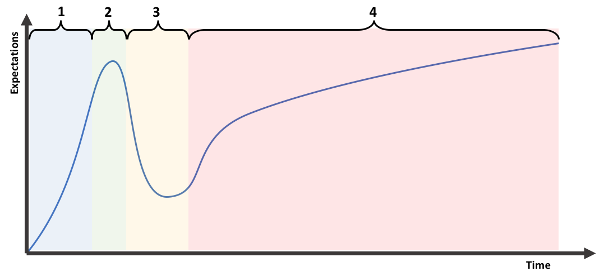
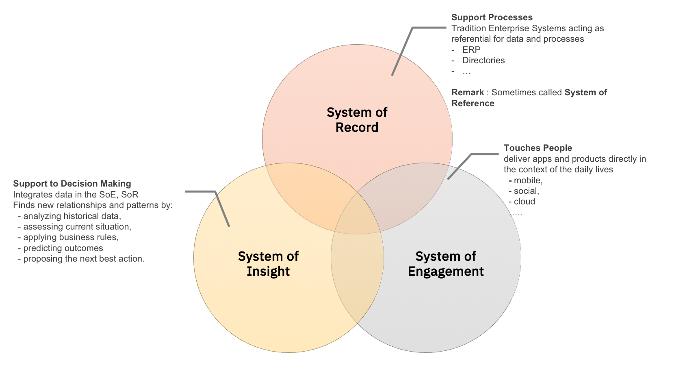

# Emerging technologies
## A continuous journey …. Always accelerating

Different concepts can be given to define and "Emerging technology"
Among them a straightforward is to associate the emerging technologies with their capability to change a current ecosystem, the way of doing.

Several characteristics can be sketched
 - The underlying promise to support a disruptive vision is a strong differenciator
 - Most of the time they don't start from a blank page but rely on older technologies that are still incubating.
 - The domain they cover is fairly ...infinite (Hardware, Software, Cognitive/IA, Analytics, Medecine, Nanotechnology, Robotics, Aeronautics  ....)
 - Evolution of other technologies landscape can sometimes be a strong enabler (Acceleration due to the emergence of cloud).
 - It is a continuous journey that keeps accelerating
 - Not all of them will sustain an industrial life

Some decades in my life:
- In **1978** :My parents have a telephone at home, with 7, 8, 10, numbers. Using it is really costly (especially WW)
- In **1988** : We have a Minitel at home. ( "11" to have the French Citizen Directory was a key innovation , and such and evolution of the WhitePages.  btw it enabled new usage as only the first 3 minutes were free :smiley:)
- In **1998** : I have a Mobile Phone.
- In **2008** : I have a SmartPhone.
- In **2018** : I have a Personal Assistant taking care of me/my home.

Different models can be drawn to map the technology changes with its market reach or it the underlying expectations we have in them

### Invention, Innovation, Diffusion, ...
**Invention:** A new idea emerges.
**Innovation:** THe idea is transformed into a 'useful' (marketable?) to society solution
**Diffusion:** The usage of the product is spreading
**Imitation:** Competition can try to take market-share by copying/enriching/re-envisionning the product

### Hype Cycle

This model draws the evolution of the interest for an emerging technologies

 Phase 01 - **Innovation Trigger** : The technology emerges as a 'good idea'. At this stage it is usually a prototype, a promising vision.
Different factors can explain  why a technology is triggered
  - Disruption/Innovation : The level of disruption id brings to the market answering current concerns or envisioning future usage
  - The Brand/Team that support the technologies ( Commercial "R&D" from companies)
  - ...

Phase 02 - **Peak of Inflated expectation** : A "buzz" is generated over the innovation. Lots of initiative arise to develop new product on this technology

Phase 03 - **Trough of desillusion** : The "so what ?" phase occurs when first implementation don't meet the high expectations.. At this stage some technology may be stopped (or postponed before rising back).

Phase 04 - **Slope of enlightment** : The industrial application of the technology is developped.

Phase 05 - **Plateau of productivity** : Technology is now mature. The scope of application can vary from a niche market up to a new industry standard.

Because they are a simple representation of a 'Point Of View' on the technology, this type of curve is often used as communication mean (See Gartner Group and can be challenged. https://www.gartner.com/technology/research/methodologies/hype-cycle.jsp )

As an example from 2015 ... 2018 (as per the Gartner Group Emerging technology HypeCycles perpective)
 - IoT Platform have emerged and expectations are currently inflating
 - Autonomous vehicle after a peak of inflated expectation positionning they adoption within 5/10 years in 2015 seems now to be positionned since 2016 as arriving to maturity in more than 10 years, associated with disillussion (currently)
 - Blockchain applications are challenged
 - Machine Learning (and its cognitive application) conserves it high expectations  

## Our 2-Days Journey
The perspective for the Emerging Technologies for this course will be around the revolution on IT platforms required to support Software disrutption : **The Emerging Technology of the Cloud Computing. - A journey in the Cloud**.

The objectives of this journey is to understand how Cloud transformed IT solution delivery:
  - Technology consumptions
  - Capabilities at our hands (Cognitive, Web, API, no SQL...)

**What it is not :** A formal lecture on how disruptive the cloud is, blablaba... A course on How to code in nodeJS..
**What it is:** Hand-on sessions in order to capture what is cloud, and how to operate it thru easy implementations around
  - A noSQL Data Repository
  - Cognitive capabilities (Real time translation, language detection, Personality profiling)
  - APIs to be integrated with the external world
  - Implemented in a seamless Build and Deploy approach
  - Hosted In the cloud !! (2-clicks provisioning, Scalability…)

### Your deliverables :
  - A project implementing what you have learned : From a provided baseline, you will be able to enrich it with as many services you want. **_The more you have, the better is is!_**
  - a 10-pager max report stating
    - your convictions/visions on  how cloud will disrupt IT delivery (Pros/cons)
    - how, as a team, you organize your work, the lessons learned

## An introduction – The App Revolution !

Web and mobile has totally transformed the way we consume applications:
 - Application are positioned everywhere, and seamlessly (Business, PErsonal Life, Social Life)
 - End user oriented: Not only User Interface but also User eXperience
 - From massive, "All-in one" , vertical corporate applications /web sites, to agile, atomic, API-based applications.

### SoR, SoE, SoI: Different types of applications, Different concerns, Different Challenges

### Applications are everywhere !
  - New ways of interacting between client and providers: Web application, Mobile Application,Wearable, IoT
  - New ways of interacting between applications : The API Economy  
  - New domains : Cognitive computing, Big Data
  - New ways of implementing : Development to Operation cycle, Agility, Velocity, FailFast !

Application Design and Delivery has been reshaped : It is about speed and choice ! :  
  - Self Service tools to address the E2E design, implementation, and run

## Developers’ expectations have evolved.
Developers now expect:
  - To be able to deploy updates to their applications in **seconds**
  - To write their code in **whichever tool or language** they choose
  - To be able to **continually integrate** working copies of code into a shared mainline at multiple points during the day
  - To **focus on writing code**, not on the administration of servers, virtualization, operating systems, and middleware.
  - To **“fail fast”** - or ensure applications fail immediately and visibly to speed debugging and fixes
  - To **integrate useful APIs** into their applications
  >who wants to write code that’s already been written and tested?

  - ...

**This is all what this journey is about**

## A brief history of Cloud
### Technology Drivers

Cloud is not an ex-nihilo invention but an evolution from IT computing since the 50s.
**1950s:** Mainframe :  a central computer accessed through 'passive' terminals
**1970s:** Virtual Machines: Hardware is 'virtualized'. More operating system can be run in a single isolated environement (For ex. The linux VM we will use in these session)
**1990s:** Several distributed initiatives emerged
  - Grid computing
  - SaaS (Online Services)
  - Virtuliazed Private Network (VPN) - Sharing Common Physical infrastructure in full confidentiality
  - Service Oriented Architecture
  - Clustering
**2010s** Emergence of new approach to deliver IT: IaaS, SaaS, PaaS, Containers, API Economy...

### Business Drivers
**Capacity Planning**
Capacity planning is the process of determining and fulfilling future demands of IT resources. It is summarized as the maximum amount of processes that an IT resource is capable of delivering in a given period of time.
The challenge is to correctly balance the resources' capacity to the End user demand (Risk analysis to be done per application type):
  - Avoiding service disruption due to to small capacity
  - Avoiding overcapacity infrastructure that is not used.

Different strategies for different risks:
- **Lead Capacity Strategy** – Strong anticipation of the demand
- **Lag Strategy** – No anticipation : IT resource is provision when its full capacity is reached
- **Match Strategy** – Trade off by relying on small increments

**Cost Reduction**
Costs can be split in
- **Acquisition Cost**
- **Operating Cost**:
  - Technical personnel required operate the environments
  - Licences Costs
  - Run Cost (Power, Cooling)
  - Access and security...
  - Administration (Licence Management...)

**Support of the Digital Transformation**

More Organizational agility is required to adapt and evolve to successfully face change caused by both internal and external factors

### Since when are servers, software, infra, represented by ... a cloud ?
hmmmm, tricky question.
By definition,
>**cloud:**        _noun_
> a mass of something such as dust or smoke that looks like a cloud: A cloud

The representation of a cloud is not well established. So ....

**My proposition:** The term _cloud_  is commonly used to describe an consolidation of objects that visually appear from a distance as... a cloud. Early used in IT as a metaphor of the Internet in computer network diagrams as an abstraction of the underlying infrastructure it represents. As a "Cloud" it is now a bag of so many thing : Infra, Servers, Network, Capabilities, Software.....

##The Promises (Expectations) of the Cloud

Cloud in the IT acception can be seen a style to deliver computing capabilities under several promises to external customers using Internet technologies :

of computing in which scalable and elastic IT-enabled capabilities are delivered as a service ”

##References

|Reference|Description|
|---|---|
|https://www.gartner.com   | Gartner Group - Emerging technologies - Hype Cycle |
|https://www.ibm.com/blogs/cloud-computing/2014/03/a-brief-history-of-cloud-computing-3/   |  IBM - A brief hisoty of Cloud Computing |
|https://dictionary.cambridge.org/fr/dictionnaire/anglais/cloud   |Cloud Definition in the Cambridge Dictionnary   |
___
Emerging Technologies - Paris Dauphine
(C) Sylvain WILBERT
